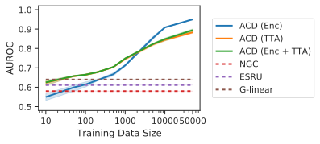

# Amortized Causal Discovery

This repo contains the official PyTorch implementation of:

Sindy Löwe*, David Madras*, Richard Zemel, Max Welling - [Amortized Causal Discovery: Learning to Infer Causal Graphs from Time-Series Data](https://arxiv.org/abs/2006.10833)

With Amortized Causal Discovery we learn to infer causal relations from samples with different underlying causal graphs but shared dynamics.
This enables us to generalize across samples and thus improve our performance with increasing training data size.


&ast;equal contribution

## What is Amortized Causal Discovery?

With Amortized Causal Discovery, we separate causal relation prediction from dynamics modelling. 
Our amortized encoder learns to infer causal relations across samples with different underlying graphs. 
Our decoder learns to model the shared dynamics of the predicted relations. 

<p align="center"> 
    
</p>

This separation allows us to train a joint model for samples with different underlying causal graphs. 
This is in contrast to previous approaches, which need to refit a new model whenever they encounter samples with a different underlying causal graph.

What we found exciting is that this allows us to achieve tremendous improvements in causal inference performance with increasing training data size. Amortized Causal Discovery (ACD) manages to outperform previous causal discovery approaches with as little as 50 training samples; with 50.000 samples it outperforms them by more than 30% points.

<p align="center"> 
    
</p>

## How to run the code

### Dependencies

- [Python and Conda](https://www.anaconda.com/)
- Setup the conda environment `ACD` by running:

    ```bash
    bash setup_dependencies.sh
    ```
- Don't forget to activate the environment and cd into the codebase directory when playing with the code later on

    ```bash
    source activate ACD
    cd codebase
    ```

### Datasets
- To generate the particles with springs dataset from our paper, run

    ``` bash
    python -m data.generate_dataset
    ```

- To generate a particles dataset with varying latent temperature, run

    ``` bash
    python -m data.generate_dataset --temperature_dist --temperature_alpha 2 --temperature_num_cats 3
    ```
  
 - To generate the Kuramoto dataset from our paper, run

    ``` bash
    python -m data.generate_ODE_dataset
    ```
    
 - The Netsim dataset is available [here](https://github.com/sakhanna/SRU_for_GCI/tree/master/data/netsim)
    

### Experiments

- Run the Springs experiment by running
    ``` bash
     python -m train --suffix _springs5
    ```
  the Kuramoto experiment with
    ``` bash
    python -m train --suffix _kuramoto5 --encoder cnn
    ```
  and the Netsim experiment with
    ``` bash
    python -m train --suffix netsim
    ```

- To run the experiment with an unobserved temperature variable, run
    ``` bash
     python -m train --suffix _springs5 --encoder cnn --decoder sim --global_temp --load_temperatures
    ```

- To run the experiment with an unobserved time-series, run
    ``` bash
     python -m train --suffix _springs5 --unobserved 1
    ```


- View all possible command-line options by running

    ``` bash
    python -m train --help
    ```    


<!---
## Want to learn more about Our Method?
Check out my [blog post](https://loewex.github.io/GreedyInfoMax.html) for an intuitive explanation of Greedy InfoMax. 

Additionally, you can watch my [presentation at NeurIPS 2019](https://slideslive.com/38923276). My slides for this talk are available [here](media/Presentation_GreedyInfoMax_NeurIPS.pdf).
-->

## Cite

Please cite our paper if you use this code in your own work:

```
@article{lowe2020amortized,
  title={Amortized Causal Discovery: Learning to Infer Causal Graphs from Time-Series Data},
  author={L{\"o}we, Sindy and Madras, David and Zemel, Richard, and Welling, Max},
  journal={arXiv preprint},
  year={2020}
}
```


## References 
- [Neural Relational Inference for Interacting Systems - Kipf et al.](https://arxiv.org/abs/1802.04687)
